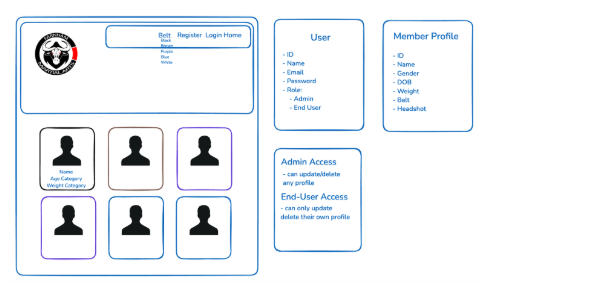

# FMA Members App

## **Description**

For the second module of the course we were tasked with building a database app designed to handle, manipulate, and securely store data while enabling seamless CRUD (Create, Read, Update, Delete) functionality for efficient data management.

I decided to build an app related to my jiu-jitsu club. The app stores and displays the profiles of members and enables a user to add/update/delete a profile. 

## **Deployment Link**

https://fma-members.netlify.app/

## **Timeframe & Working Team (Solo/Pair/Team)**

We were given one week to complete this project, working independently.

## **Brief**

Build an App using express/node enabling CRUD and data management.

* The app utilizes EJS Templates for rendering views to users.  
* The app uses session-based authentication.  
* The app has at least one data entity in addition to the User model. At least one entity must have a relationship with the User model.  
* The app has full CRUD functionality.  
* Authorization is implemented in the app. Guest users (those not signed in) should not be able to create, update, or delete data in the application or access functionality allowing those actions.  
* The app is deployed online so that the rest of the world can use it.

## **Technologies**

* Node.js  
* Express.js  
* MongoDB Compass  
* Postman

## **Attribution**

[https://www.flaticon.com/free-icons/home-button](https://www.flaticon.com/free-icons/home-button)

## **Planning**

Having decided to build a jiu-jitsu app based on member profiles at my club I went about planning the full scope of the app. I set-up a trello board to help plan and deliver the project. Initially I did some whiteboarding, trying to determine the overall look and feel of the app. By the end of this process I had established the layout, the different models and the user story.

[Trello Board](https://trello.com/b/WWhKGKHI/jiu-jitsu-app)



## **User Story**

* As a visitor on the landing page I should see a nav bar.  
* As a visitor I can return to the landing page by clicking on the Home button.  
* As a visitor I can view all the members of the club from the nav bar.  
* As a visitor I should be able to filter the members according to their belt category.  
* As a visitor I can register my own membership by completing the Registration form.  
* As a User I can create my own profile.  
* As a User I can log in to my account.  
* As a User I can only update/delete my own profile.  
* As an Admin User I can add/update/delete any profile.

## **Build/Code Process**

* Install dependencies.  
* Built schema models.  
* Connect to database  
* Gathering resources, e.g. images and data.  
* Created data file, storing the profiles information as Json objects.  
* Created a seed file.  
* Created Controllers and tested routes in Postman.  
* Import the controllers to the server file.  
* Once routers thoroughly tested in Postman moved on to the front-end  
* Created different views for members model, starting with index which GETs all members, followed by the ‘show’ view for a single member. 

For the members index I wrote code that sets a border to the belt colour of the member and displays an instagram and/or facebook handle if they have one.

```
<%- include('../home') %>
    <section class="profiles-container">
      <% allMembers.forEach((member) => { %>
        <div class="profile-pic">
            <a href="/members/<%= member._id %>">
                " 
                    alt="<%= member.name %>" 
                    style="border: 6px solid <%= member.belt %>;
                        <% if (member.belt.toLowerCase() === 'white') { %>
                            outline: 2px solid rgba(0, 0, 0, 0.2);
                        <% } else if (member.belt.toLowerCase() === 'blue') { %>
                            border: 6px solid #2667ff;
                        <% } else if (member.belt.toLowerCase() === 'purple') { %>
                            border: 6px solid #5a2086;
                        <% } else if (member.belt.toLowerCase() === 'brown') { %>
                            border: 6px solid #774936;
                        <% } %>
                    ">
            </a>
            <h3><%= member.name %></h3>
            <h4><%= member.belt %> Belt</h4>
            <div class="social-icons">
                <% if (member.instagram && member.instagram !== "") { %>
                    <a href="<%= member.instagram %>" target="_blank">
                        
                    </a>
                <% } %>
                <% if (member.facebook && member.facebook !== "") { %>
                    <a href="<%= member.facebook %>" target="_blank">
                        
                    </a>
                <% } %>
            </div>
        </div>
    <% }) %>
    
    </section>
<%- include('../footer') %>
```
* Created the forms for posting and updating new members  
* Created view for user login and creating new account.  
* Completed nav bar and added styling to the website.

## 🎬 FMA App Demo


Members need to be logged in to update their profile and can only update their own profile. Admin users however have full access and can update any profile.

## 🎬 Updating Profile


## **Challenges**

The main challenge in this project were the many new concepts introduced, such as making asynchronous calls to the database, middleware for error handling and the general nature of the back-end interacting with the front-end. Understanding and implementing user authentication using bcrypt and checking the user session.

## **Wins**

* Planning models helped map out the build approach and define relationships between components.  
* Delivered an app with a polished and intuitive look and feel.  
* Utilising Bootstrap for responsive and user-friendly forms.
* Belt filtering and dynamically updating the profile border when belt field is updated.
* Permission and user accessibility based on user role \- an admin user can add/update/delete any profile whereas an End User can only edit/delete their own profile.  
* Integrated image upload functionality with placeholder images for profiles without uploads. 
* Cleanly handled validation errors to enhance user experience.
* Added a sign-out button for seamless user navigation.

## **Key Learnings/Takeaways**

I have a much better understanding of all the technologies used and the general concept of a client/browser interacting with the server. 

I already had some experience using Postman in previous roles, but this project helped cement my understanding of what Postman is and how it is an essential tool for database projects.

I also better understand the absolute necessity to be able to debug and understand error messages.

## **Bugs**

The belt section is hidden when selecting a belt to filter the profiles by. You have to click the belt icon again to filter again.

## **Future Improvements**

I could enhance the user experience by implementing the following features:

* Admin Users can assign roles to other users.  
* Forgotten password feature.  
* Add a search bar.  
* Remove update and delete profile buttons if the user does not have permission.
